# Identifier Provisioning

This gear provisions NACCIDs for data entered with Participant Enrollment and Transfer (PTENRL) forms.

## Processing

The following diagrams describe the processing of the PTRENRL form data.

First, check that the module for the form is the right one, and then determine whether this is a new enrollment or transfer.

```mermaid
graph TB
    start((*)) -->module{module is\nPTENRL} -- no --> moduleerror((error))
    module -- yes --> enrltype{Is new\nenrollment?}
    enrltype -- yes --> newenrollment(New Enrollment)    
    enrltype -- no --> transfer(Transfer)
    newenrollment --> stop((done))
    transfer --> stop
style start fill:#000, stroke:#000
```

### New Enrollment

A new enrollment involves a series of validations that result in errors if the identifying information is inconsistent.
The last step checks the demographics, and if any NACCIDs exists with matching demographics, an error is reported.
In this case, someone will need to manually check the match.
If there are no existing participants that could be matches, then a new NACCID is provisioned.

```mermaid
graph TB
    start((*)) --> naccidforptid{Does NACCID\n exist for\n ADCID,PTID?}
    naccidforptid -- yes --> errorptid((error))
    naccidforptid -- no --> naccidforguid{Does NACCID\n exist for\n GUID?}
    naccidforguid -- yes --> errorguid((error))
    naccidforguid -- no --> checkdemographics{Does NACCID\n exist for\n demographics?}
    checkdemographics -- yes --> errordemo((error))
    checkdemographics -- no --> provision(Provision new NACCID) --> stop((done))
style start fill:#000, stroke:#000
```

### Transfer

A transfer could either be for the receiving center or the previous center.

```mermaid
graph TB
    start((*)) --> prevenrolled{Was\n previously\n enrolled?}
    prevenrolled -- no --> transferout{Transferring\n elsewhere?}
    prevenrolled -- yes --> oldptidknown{Is old\n PTID known?}
    oldptidknown -- no --> identifytransfer(Identify Transfer)
    oldptidknown -- yes --> naccidforoldptid{Does NACCID\n exist for PTID\n of previous\n enrollment?}
    naccidforoldptid -- no --> nonaccid((error))
    naccidforoldptid -- yes --> existingnaccid{Does\n provided\n NACCID\n match?}
    existingnaccid -- no --> mismatch((error))
    existingnaccid -- yes --> logtransfer1(Confirm Transfer)
    transferout -- no --> whattransfer((error))
    transferout -- yes --> logtransfer(Record Transfer)
style start fill:#000, stroke:#000
```

A form from a "previous" center, will indicate that the center is aware of the transfer.
This case is indicated in the diagram by the record transfer activity:

*Record Transfer*: know reported ADCID for new center.
    Automation: Capture transfer information in enrollment metadata.
    (No error?)

For a form from a receiving center, the goal is to verify the identity of the participant and that the previous center knows about the transfer.
The activies in the diagram for this case are:

*Identify Transfer*: know reported ADCID for previous center, but participant's identity at previous center is not confirmed.
Possible automation check recorded transfers for possible match based on reported demographics.
Would appear as error to center.

*Confirm Transfer*: know reported ADCID for previous center.
If previous center reported transfer and details match, associate NACCID to new ADCID, PTID and mark old association as "inactive" (maybe not the right idea)
Otherwise, create error, and then need to manually confirm transfer with centers.
