# Identifier Provisioning

This gear provisions NACCIDs for data entered with Participant Enrollment and Transfer (PTENRL) forms.

## Processing

The following diagrams describe the processing of the PTRENRL form data.

First, check that the module for the form is the right one, and then determine whether this is a new enrollment or transfer.

### New Enrollment

A new enrollment involves a series of validations that result in errors if the identifying information is inconsistent.
The last step checks the demographics, and if any NACCIDs exists with matching demographics, an error is reported.
In this case, someone will need to manually check the match.
If there are no existing participants that could be matches, then a new NACCID is provisioned.

### Transfer

A transfer is reported by the receiving center.
The form has a slight ambiguity about whether it is a transfer out of a center or into a center.

When a form represents a transfer into a center, the goal is to

* identify the participant by NACCID
* confirm that the participant has transferred
* link new identifiers to the NACCID

```mermaid
graph TB
    start((*)) --> naccidprovided{Is NACCID\n provided?}
    naccidprovided -- yes --> hasparticipant{Is there a participant for provided NACCID?}
    naccidprovided -- no --> prevenrolled{Was\n previously\n enrolled?}
    hasparticipant -- yes --> prevenrolled
    hasparticipant -- no --> noparticipant((error))

    prevenrolled -- yes --> oldptidknown{Is old\n PTID known?}
    prevenrolled -- no --> whattransfer((error))
    prevenrolled -- unkwnown --> recordtransfer(Create transfer record) --> pendingerror((error))

    oldptidknown -- yes --> naccidforoldptid{Does NACCID\n exist for PTID\n of previous\n enrollment?}
    oldptidknown -- no --> identifytransfer(Record pending\n incoming transfer\n needing identification) --> identifyerror((error))
    naccidforoldptid -- yes --> existingnaccid{Does\n provided\n NACCID\n match?}
    naccidforoldptid -- no --> nonaccid((error))
    existingnaccid -- yes --> recordtransfer
    existingnaccid -- no --> mismatch((error))
style start fill:#000, stroke:#000
```
  

