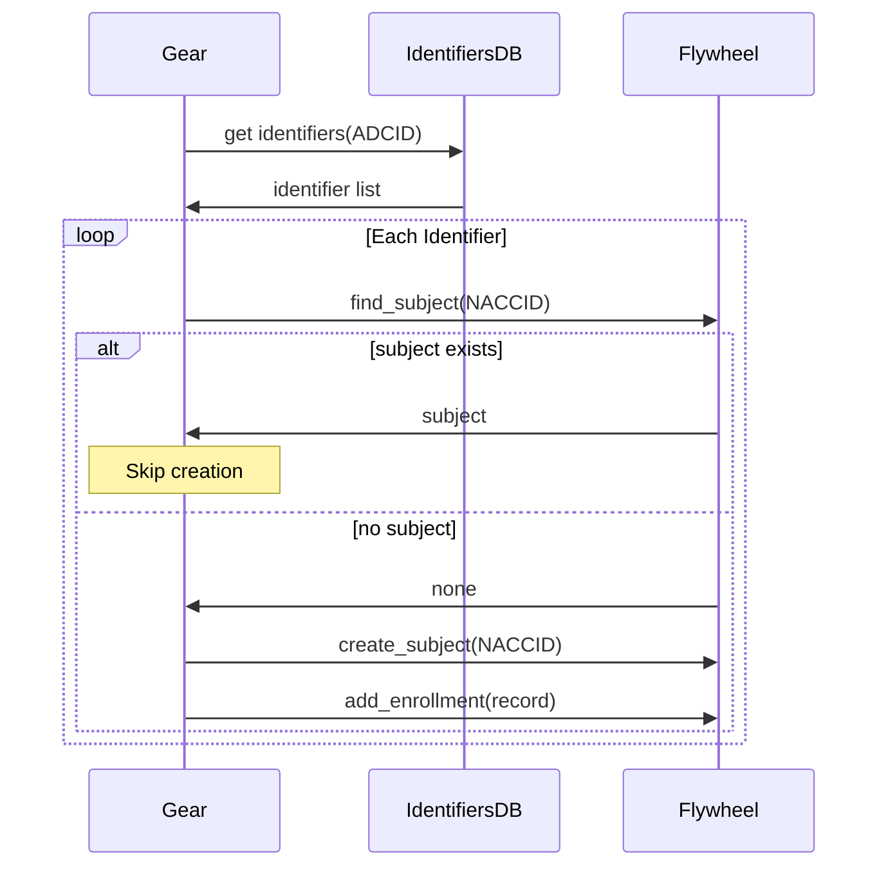

# Legacy Identifier Transfer

This gear transfers legacy NACC IDs from the identifiers database into Flywheel by creating subjects and enrollment records.

## Processing

The following diagrams describe the processing of legacy identifiers.

First, the gear retrieves all identifiers for a center's ADCID and validates each one before creating enrollment records.

```mermaid
graph TB
    start((*)) --> getids{Get Center\nIdentifiers} -- success --> validate{Validate\nIdentifiers}
    getids -- fail --> error1((error))
    validate -- valid --> process{Process\nEnrollments}
    validate -- invalid --> error2((error))
    process -- success --> createSubjects(Create Subjects)
    process -- existing --> skip(Skip Creation)
    createSubjects --> stop((done))
    skip --> stop
style start fill:#000, stroke:#000
```

## Enrollment Processing

Each identifier is validated and used to create enrollment records. The gear checks for existing subjects to avoid duplicates.

```mermaid
graph TB
    start((*)) --> validateId{Validate\nIdentifier} 
    validateId -- invalid --> error1((error))
    validateId -- valid --> checkNaccid{Check NACCID\nExists}
    checkNaccid -- exists --> skip((skip))
    checkNaccid -- new --> createSubject(Create Subject)
    createSubject --> addEnrollment(Add Enrollment)
    addEnrollment --> stop((done))
style start fill:#000, stroke:#000
```

