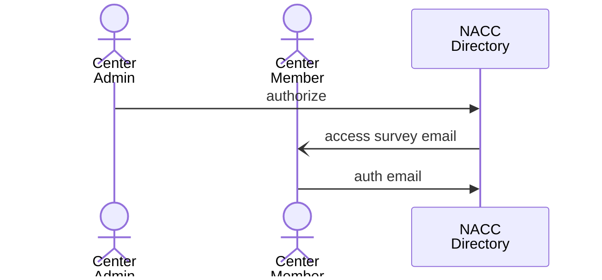
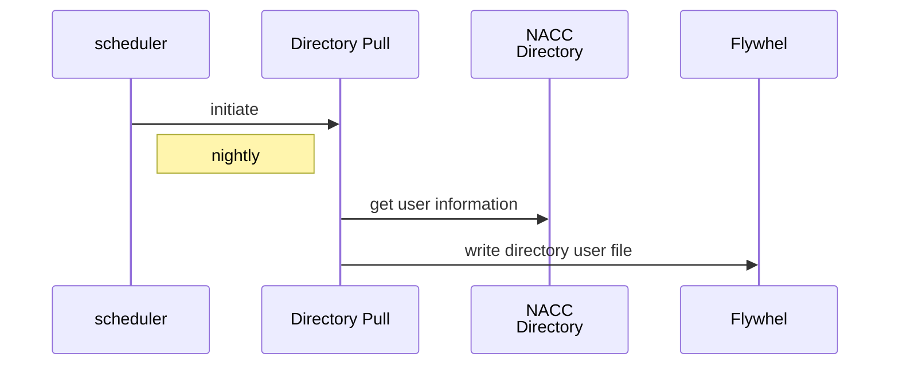
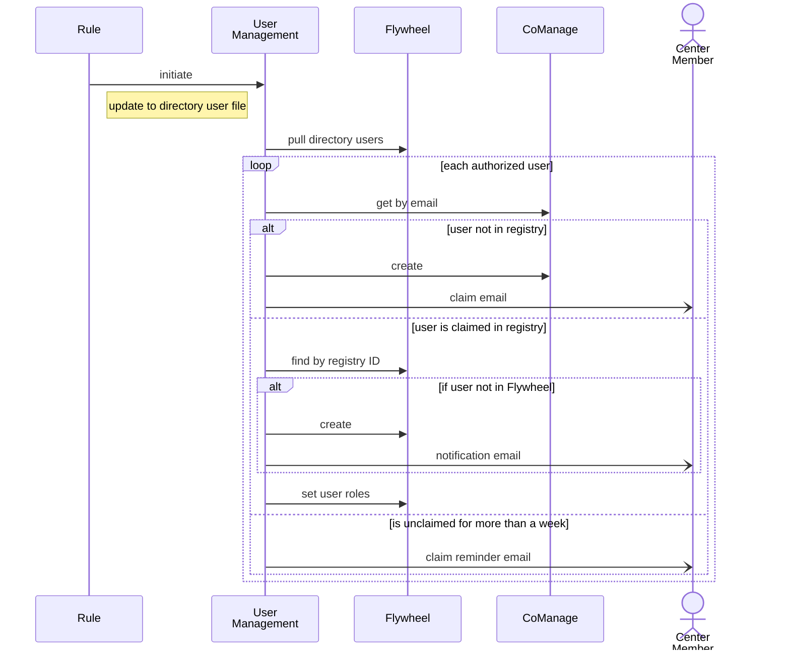

# User management

The user management utility reads user information from the user directory file and authorizations file, and for each user may

1. register the user in the CoManage registry, and email instructions to claim the registry record;
2. if the user registry record is claimed
   1. add the user to Flywheel,
   2. add authorized users to REDCap projects, and
   3. add user roles (from authorization file) to Flywheel projects.
3. remind the user if their record has not been claimed

## User Enrollment Process

### Center member authorization

A center member is authorized as a user of the NACC Directory by the Center Administrator.
In this process, the administrator adds a center member to the NACC Directory in REDCap and authorizes their access to the NACC Data Platform.
Authorization initiates a Data Platform Access survey that prompts the user to provide the email to be used for authentication.



### Pulling NACC Directory

The directory is pulled nightly to Flywheel using the [Directory Pull](../pull_directory/) gear.
This gear writes a file with user information in an admin project on Flywheel.



### User management

Updates to the NACC directory user file trigger a gear rule that runs the user management gear.



## Environment

The gear should be run in an environment with environment variables `AWS_SECRET_ACCESS_KEY`, `AWS_ACCESS_KEY_ID`, and `AWS_DEFAULT_REGION` set.
These are used to access parameters in the AWS parameter store.

Parameters must be set for 

- CoManage API calls, and
- sender address for sending email notifications.

The gear also sends emails using AWS SES templating and needs templates for
 
- claiming registry record
- reminder for claiming registry record, and
- user creation. 

## Flywheel configuration

The script expects two YAML files as input: the list of users, and the map from user authorizations to Flywheel role names.

The user file should contain a list of user information

```yaml
---
- active: <Boolean>         # whether the user is active at a center
  adcid: <integer ID>       # the ADCID for the center
  auth_email: <email-address> # email address for authentication (registry)
  authorizations:           
    approve_data: <Boolean> # whether user can approve data
    audit_data: <Boolean>   # whether user audits data quality
    study_id: <study ID>    # string ID for study
    submit:
    - <datatype name>       # datatypes which user can submit
    view_reports: <Boolean> # whether user can view reports
  email: <email-address>    # user email
  name:
    first_name: <user first name> 
    last_name: <user last name>
  org_name: <center name>
```

The fields `active`, `name`, `email` and `auth_email` are required.
The `auth_email` field may be `null`.
The remaining fields can only be given if `active` is `true`.

The `email` field indicates the user's primary email address, while `auth_email` is the email address either through an InCommon identity provider or ORCiD.

The authorization map defines a mapping $project\to (authorization\to role)$

```yaml
---
<project-id>:
  approve-data: <rolename>
  audit-data: <rolename>
  view-reports: <rolename>
  submit-form: <rolename>
  submit-image: <rolename>
```

Valid project IDs are determined by the project management script.
These are:

- `accepted` or `accepted-<study-id>`
- `metadata`
- `ingest-<datatype>` or `ingest-<datatype>-<study-id>`
- `sandbox-<datatype>` or `sandbox-<datatype>-<study-id>`

The datatypes and study IDs are determined by the study definition used by project management.

The role names are set in the Flywheel instance.
Roles used by NACC for center users include `read-only`, `curate` and `upload`.

If an authorization has no access to a project, it should be left off the list.
For instance, `submit-form` would have no corresponding role for `ingest-dicom`
