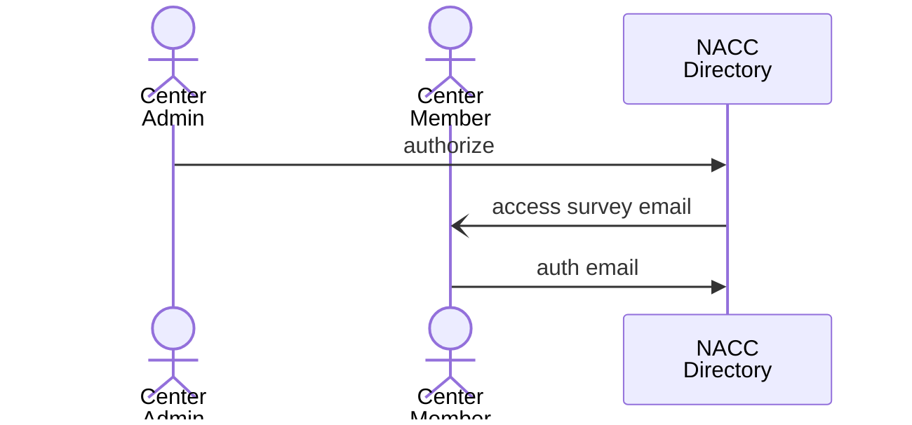
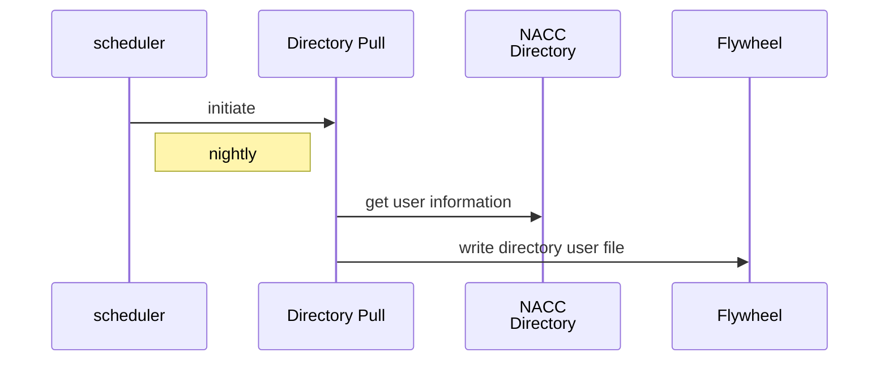
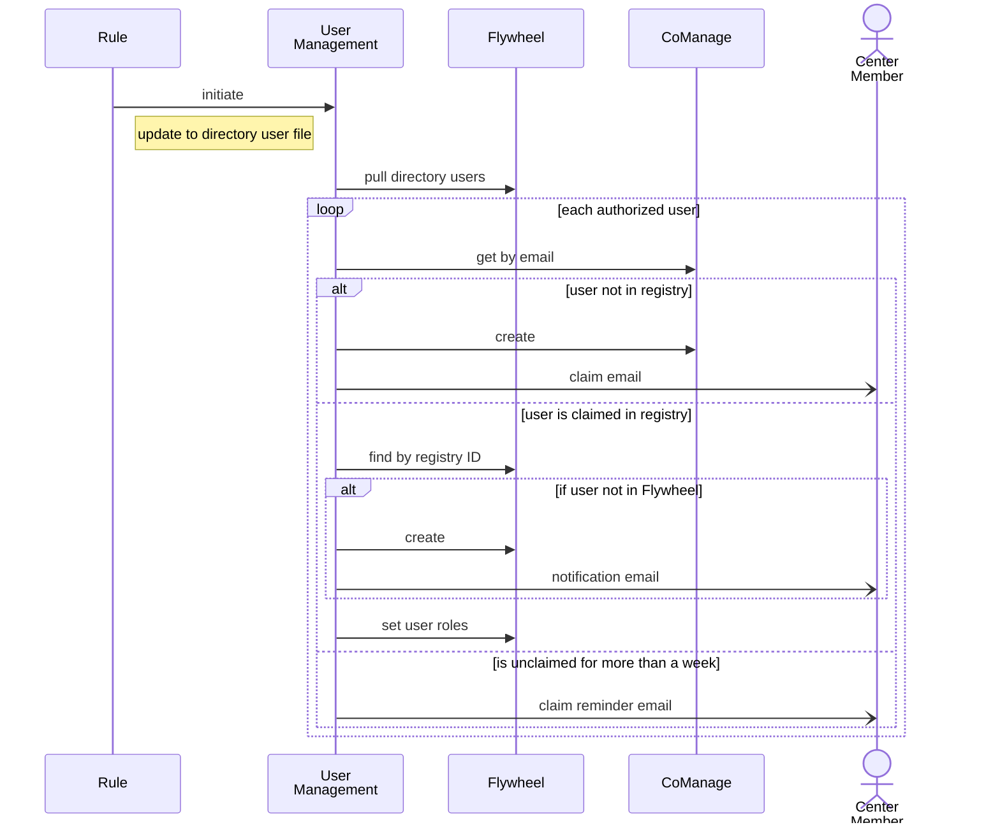

# User Enrollment Process

## Center member authorization

A center member is authorized as a user of the NACC Directory by the Center Administrator.
In this process, the administrator adds a center member to the NACC Directory in REDCap and authorizes their access to the NACC Data Platform.
Authorization initiates a Data Platform Access survey that prompts the user to provide the email to be used for authentication.

## Pulling NACC Directory

The directory is pulled nightly to Flywheel using the [Directory Pull](../pull_directory/) gear.
This gear writes a file with user information in an admin project on Flywheel.

## User management

Updates to the NACC directory user file trigger a gear rule that runs the user management gear.

